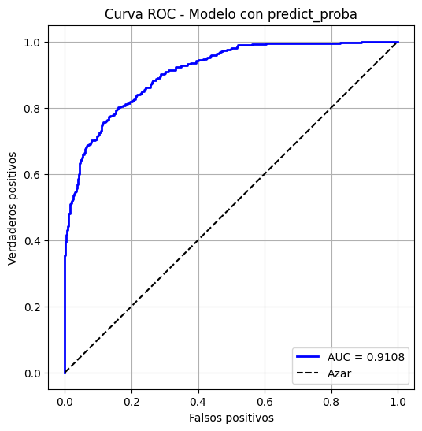

# telecom-churn-prediction
Proyecto de Machine Learning para predecir la baja de clientes (churn) en una empresa de telecomunicaciones. Incluye análisis exploratorio (EDA), preparación de datos, modelado con LightGBM, ajuste de hiperparámetros y evaluación con la métrica AUC-ROC.

## Incluye:  
- Análisis exploratorio de datos (EDA)  
- Preprocesamiento de datos  
- Construcción de pipelines de Machine Learning  
- Modelado con **LightGBM**  
- Ajuste de hiperparámetros con GridSearch  
- Evaluación con la métrica **AUC-ROC**, además de Accuracy y F1 Score 

## 📂 Notebooks
- [01 – Análisis Exploratorio y Plan](telecom-churn-prediction/Notebooks/01_eda_plan.ipynb)  
- [02 – Generación del Modelo](telecom-churn-prediction/Notebooks/02_modelado.ipynb)  
- [03 – Resultados](telecom-churn-prediction/Notebooks/03_resultados.ipynb)  

## Resultados
El modelo final alcanzó los siguientes resultados en el conjunto de prueba:

- **AUC-ROC:** 0.91  
- **F1 Score:** 0.73  
- **Accuracy:** 0.87  

La siguiente gráfica muestra la curva ROC del modelo optimizado:

## Conclusiones

El modelo LightGBM mostró un mejor rendimiento frente a otros modelos base, logrando un AUC-ROC de 0.91.

El uso de SMOTE ayudó a balancear la clase minoritaria, mejorando el F1 Score.

Este proyecto demuestra el uso de pipelines, preprocesamiento y optimización de hiperparámetros en un caso realista de predicción de churn.
